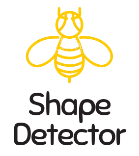

# ```Image Classification ```
# 

## Description
```
This project is for images classification on simple and fiheye images
```
## Datasets
```bash
https://github.com/marcusklasson/GroceryStoreDataset
```
## Get started
```bash
git clone https://github.com/lindaAcc/ImagesClassification.git
```
## Prerequisites
- `Python 3`
- `PyTorch`
---
## Authors
- Youssra Bourkhich
- Linda Ben boudiaf -> [lindaAcc](https://github.com/lindaAcc)
---
## Supervisors
- [Florence Cloppet](http://helios.mi.parisdescartes.fr/~cloppet/)
- [Camille Kurtz](http://camille-kurtz.com/)
